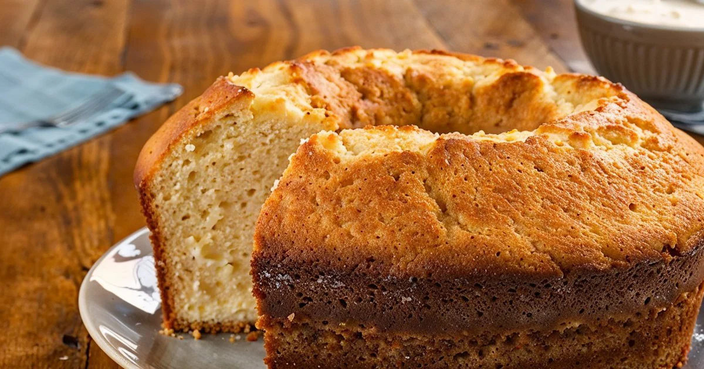

<!DOCTYPE html>
<html lang="pt-BR">
<head>
    <meta charset="UTF-8">
    <meta name="viewport" content="width=device-width, initial-scale=1.0">
    <title>bolo 3</title>
 
</head>
<body>
    <h1>bolo tutorial</h1>
    
    

    <ingredients>
        <h2>Ingredientes</h2>
        <ul>
            <li>1 xícara de açúcar</li>
            <li>2 xícaras de farinha de trigo</li>
            <li>3 ovos</li>
            <li>1/2 xícara de leite</li>
            <li>1 colher de sopa de fermento em pó</li>
        </ul>
        <preparo>
            <h2>Modo de Preparo</h2>
            <ol>
                <li>Pré-aqueça o forno a 180°C.</li>
                <li>Em uma tigela, bata a manteiga e o açúcar até obter uma mistura cremosa.</li>
                <li>Adicione os ovos, um de cada vez, batendo bem após cada adição.</li>
                <li>Em outra tigela, misture a farinha de trigo e o fermento em pó.</li>
                <li>Adicione a mistura de farinha à mistura de manteiga, alternando com o leite, começando e terminando com a farinha. Misture até ficar homogêneo.</li>
                <li>Despeje a massa em uma forma untada e enfarinhada.</li>
                <li>Asse por cerca de 30-35 minutos, ou até que um palito inserido no centro do bolo saia limpo.</li>
                <li>Deixe o bolo esfriar antes de desenformar e servir.</li>
                

                <button onclick="window.open('https://github.com/isaakzsouzes-boop')">Clique para ir no meu GitHub</button>
            </ol>
        </preparo>
    </ingredients>
</body>
</html>
